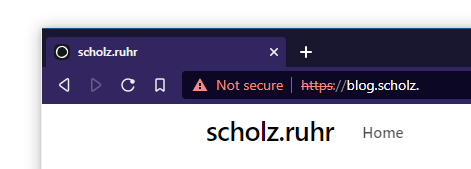

> Attention: This is an outdated post. Since it was published, I've written a more complete article about a real alternative DNS root. I'll leave this up not to break any existing links. You can find the new post [here](https://scholz.ruhr/post/real-alternative-dns-roots). 

> Note: We will technically not set up a “true” alternative DNS root, although it will do exactly the same. I will explain the differences later on.

Can you really trust your domain registrar? After all they could at any point decide to just delete your domain. A solution? Becoming your own registrar. But since all TLDs are already being managed by somebody, and registering a new gTLD would [set you back around US$185,000](https://newgtlds.icann.org/en/applicants/global-support/faqs/faqs-en):

> The evaluation fee is US$185,000. Applicants will be  required to pay a US$5,000 deposit fee per requested application slot when  registering. The deposit will be credited against the evaluation fee. Other  fees may apply depending on the specific application path. See the section 1.5 of the [_Applicant Guidebook_](https://newgtlds.icann.org/applicants/agb) for  details about the methods of payment, additional fees and refund schedules.

And even if you opt for that option, in theory ICANN could delete your TLD as they wish.

## DNS Crash Course

Another, way more interesting solution is the creation of an _alternative DNS root_. Since DNS is a distributed protocol, all (global) DNS requests start at the [Root Servers](https://www.iana.org/domains/root/servers) (the IP addresses of the Root Servers themselves are needed to bootstrap the process and are usually being packaged with the DNS software you use in the [Root Hints File](https://www.iana.org/domains/root/files)). For example, if you wanted to request scholz.ruhr, the first step in resolving this domain is finding out how to resolve .ruhr domains:

```sh
merlin@laptop:~> dig scholz.ruhr +trace

; <<>> DiG 9.16.19 <<>> scholz.ruhr +trace
;; global options: +cmd
.			55342	IN	NS	h.root-servers.net.
.			55342	IN	NS	i.root-servers.net.
.			55342	IN	NS	j.root-servers.net.
.			55342	IN	NS	k.root-servers.net.
.			55342	IN	NS	l.root-servers.net.
.			55342	IN	NS	m.root-servers.net.
.			55342	IN	NS	a.root-servers.net.
.			55342	IN	NS	b.root-servers.net.
.			55342	IN	NS	c.root-servers.net.
.			55342	IN	NS	d.root-servers.net.
.			55342	IN	NS	e.root-servers.net.
.			55342	IN	NS	f.root-servers.net.
.			55342	IN	NS	g.root-servers.net.
;; Received 811 bytes from 192.168.255.1#53(192.168.255.1) in 4 ms

ruhr.			172800	IN	NS	anycast24.irondns.net.
ruhr.			172800	IN	NS	anycast23.irondns.net.
ruhr.			172800	IN	NS	anycast10.irondns.net.
ruhr.			172800	IN	NS	anycast9.irondns.net.
ruhr.			86400	IN	DS	25131 10 2 EC453960C396742EFA2EF815FA9C9DBA146E838F86F11643704C1630 424F4E78
ruhr.			86400	IN	RRSIG	DS 8 1 86400 20210904050000 20210822040000 26838 . Imh3craEWTqcXKij72tVd20uWbDfHdTpy/H6jpes0lPbfRAcxlHMENL2 nyIc+cFWXoPQhpYaJFRJb0okg/HOx+btyFWrWv36sgbp3p/QkbsaZ3gC 4dYZD+wymjudx4rsfNdZH/Qo9k0+QvOCYpgOqy7xh2VjDch5i+ZA3YzY KUGgIxG7NgfufgJe9XwM4FR6uHctn7YvnnVz3r3NbzxNuvBJiuIj61ZK EVgAik3hZQsA/0bSeiXU7Qj9w9h1DiE9SAhlTBp1zxDNjJL8uEZ8frhs /PKpJdpNEo1km00H3ir8VioyYSKkkReaRO1v4Wj8Av5MnHbKM3Jbrjtu vVuosA==
;; Received 685 bytes from 192.112.36.4#53(g.root-servers.net) in 24 ms
```

As you can see, the first request goes to the Root Servers (whose order is randomized for load balancing) to find out how to resolve .ruhr domains. Afterwards, the resolving continues recursively as usual:

```
scholz.ruhr.		86400	IN	NS	freedns4.registrar-servers.com.
scholz.ruhr.		86400	IN	NS	freedns2.registrar-servers.com.
scholz.ruhr.		86400	IN	NS	freedns3.registrar-servers.com.
scholz.ruhr.		86400	IN	NS	freedns1.registrar-servers.com.
tmkqchcq1683nopo94uhefgo2qdrakov.ruhr. 43200 IN	NSEC3 1 0 12 36343552179D4DFB TMM19QLSJ3M9E1CLTLMICPCCT4UFDTGU NS
tmkqchcq1683nopo94uhefgo2qdrakov.ruhr. 43200 IN	RRSIG NSEC3 10 2 43200 20210902050916 20210819050916 27845 ruhr. Xb22peKB+JjxEpSs9wdebhwnogbbBJLhsak3g2uq5qA0NAIsQtnUuVxB liXVZVEM1OU46lhBOM4csv2yvVGUK2s7h67Rvc3FJnJwAaWDfw1wyCaY 7VEO/WW+7NyMzpsy3Pz3VbUowxUdVvffuO9G9jkY8xfok3/WbRSrGdOL tSg=
;; Received 399 bytes from 195.253.64.11#53(anycast9.irondns.net) in 27 ms

scholz.ruhr.		300	IN	A	152.70.184.10
;; Received 56 bytes from 45.58.122.82#53(freedns1.registrar-servers.com) in 87 ms
```    

The Root Servers hold a list of all TLDs authoritative nameservers. You can download them [here](https://www.internic.net/domain/root.zone) and they even let you send AXFR requests to some Root Servers, so you could also download a list of all TLD nameservers through dig: `dig AXFR . @lax.xfr.dns.icann.org`

## (A Fake) Alternative DNS Root

Back to the registrar thing: How do you become a registrar (for free)? In theory you could replace the Root Hints file on all of your clients. This is cumbersome (if not impossible, think about phones, game consoles, …) to say the least. Another, way easier option is to use a DNS server that has a “modded” Root Hints File that resolves all of your own TLDs and falls back to the official ones for normal domains. That way, you just have to point your clients to a new DNS server, which almost every client supports. There already are providers that offer you such servers, one example is [OpenNIC](https://www.opennic.org/). But using someone else’s servers is boring, so let’s set this up ourselves.

I’ll use a bunch of Oracle Cloud aarch64 VMs as they are [available for free](https://www.oracle.com/cloud/free/). Also I’ll use Oracle Linux 8, so everything should work the same on RedHat Linux 8, CentOS 8, RockyLinux 8, AlmaLinux 8, VzLinux 8, … and with some minor modifications on basically every other UNIX-like system.

We will need at least 2 machines for our fake alternative DNS root. In theory we could run all of this on a single VM but where is the fun in that? We will use:

*   Modded DNS Resolver: This one will serve as the DNS recursor _and_ as authoritative nameserver for our zone. In a proper production setup you would want to only serve the NS records off of the resolver.
*   Web Server to verify whether everything is working (I’ll just use this blog)

### Modded DNS Resolver

This is probably the most difficult thingm but still easily doable. I’ll skip the VM creation and inital system setup (like copying SSH keys, updating the system) for now. At this point there already was a hurdle for me, as PowerDNS only provides x86\_64 repos. So I opted to use BIND:

```sh
sudo dnf install bind
sudo systemctl enable --now named
```   

At this point, access from localhost should already work:

```sh
[opc@adn-root-s-cin-defra-843f ~]$ dig scholz.ruhr. @localhost

; <<>> DiG 9.11.26-RedHat-9.11.26-4.el8_4 <<>> scholz.ruhr. @localhost
;; global options: +cmd
;; Got answer:
;; ->>HEADER<<- opcode: QUERY, status: NOERROR, id: 48815
;; flags: qr rd ra; QUERY: 1, ANSWER: 1, AUTHORITY: 4, ADDITIONAL: 1

;; OPT PSEUDOSECTION:
; EDNS: version: 0, flags:; udp: 1232
; COOKIE: 91a0df1eec94c9855a888c0661227b53a4fb7f069b94dce0 (good)
;; QUESTION SECTION:
;scholz.ruhr.			IN	A

;; ANSWER SECTION:
scholz.ruhr.		288	IN	A	152.70.184.10

;; AUTHORITY SECTION:
scholz.ruhr.		86353	IN	NS	freedns3.registrar-servers.com.
scholz.ruhr.		86353	IN	NS	freedns1.registrar-servers.com.
scholz.ruhr.		86353	IN	NS	freedns4.registrar-servers.com.
scholz.ruhr.		86353	IN	NS	freedns2.registrar-servers.com.

;; Query time: 0 msec
;; SERVER: ::1#53(::1)
;; WHEN: Sun Aug 22 16:29:07 GMT 2021
;; MSG SIZE  rcvd: 197
```

To make the server accessible from the outside, we will have to modify `/etc/named.conf`. We will change `listen-on port 53 { 127.0.0.1; };` tp `listen-on port 53 { any; };` (the same for ipv6) and `allow-query { localhost; };` to `allow-query { any; };`. Keep in mind that this makes the server vulnerable to DNS amplification attacks, as described in the config file. This is also the reason why probably none of my test servers will be available after I’ve published this article. In a proper production environment you would either limit the allowed clients or implement protection against those attacks.

Also, remember to open the firewall for port 53: `sudo firewall-cmd --add-port=53/udp --zone=public --permanent && sudo firewall-cmd --reload`. The same goes for any firewall your cloud provider may use. At this point, you should be able to send DNS requests to your own server using its public IP address. Up until now, this has been a “normal” tutorial on setting up a DNS resolver, now let’s get into the fun part.

Let’s open up `named.conf` once again. At the bottom of the file you should find the definition of the root zone:

```
zone "." IN {
        type hint;
        file "named.ca";
};
``` 

In this case, `named.ca` is our Root Hint file. We will append this config block with the following:

```
# /etc/named/zones/db.scholz
zone "scholz" IN {
        type master;
        file "/etc/named/zones/db.scholz";
};
``` 

It is a **terrible idea** to use my name as TLD, as the ICANN could decide to create a scholz gTLD or maybe some other person already uses a scholz TLD. They are not reserved after all, so anything is possible.

Afterwards, we will fill `/etc/named/zones/db.scholz` with the bare minimum:

```
@		IN      SOA     ns1.scholz. admin.scholz. (
                    3     ; Serial
                604800     ; Refresh
                86400     ; Retry
            2419200     ; Expire
                604800 )   ; Negative Cache TTL

        IN      NS      ns1.scholz.
ns1.scholz.	IN	A	0.0.0.0
blog.scholz.	IN	A	152.70.184.10
```    

Of course, in a production setup you should use more than a single nameserver. Replace the 0.0.0.0 with the IP address of your recursor OR with a proper authoritative nameserver. The `blog.scholz.` entry is there to test things and points to the VM that serves this blog.

### Configuring the Clients

This is the exiting part. We reconfigure our laptop, phone or whatever to actually use our modded nameserver. If you are this far into the article you probably know how to change your own DNS server, so we will jump directly to trying out everything:



It works!

Apart from a non-matching certificate, everything works as expected! Note that you will have to input the URL including the https part, otherwise most browsers will just use a search engine due to not recognizing the TLD. The missing cert may be a topic for the next article.

## A True Alternative DNS Root

To have a true alternative DNS root, we would have to replace our single resolving DNS server with two servers: One that uses some other Root Servers, and one that acts as Root Server. The result would mostly be the same, except for the fact that other people could easily set up DNS resolvers that point to our Root Server.

### Root Zone Files and Root Servers

Serving the root zone would be mostly trivial: As stated earlier, IANA let’s you [download their Root Zone Files](https://www.iana.org/domains/root/files). Serving them is as simple as a default BIND installation with recursion turned off and a `.` zone pointing to that file. After that, you can add any TLD you want to the Root Zone File. Just restart the BIND instance, and all DNS resolvers using your Root Servers will accept that new TLD.

### Setting up the Resolver

A “default” BIND installation is already set up to act as a normal resolver (if only for localhost by default). The only thing left to do is replacing the `root.hint` (or `named.root`, depending on the system) file with something like this:

    .                        3600000      NS    NS1.EXAMPLE.
    NS1.EXAMPLE.             3600000      A     0.0.0.0
    NS1.EXAMPLE       .      3600000      AAAA  ::
    
    .                        3600000      NS    NS2.EXAMPLE.
    NS2.EXAMPLE.             3600000      A     0.0.0.0
    NS2.EXAMPLE       .      3600000      AAAA  ::
    

You could also just append to the existing file, to be “backwards compatible”. The default Root Hints are available at [https://www.internic.net/domain/named.root](https://www.internic.net/domain/named.root). One thing to keep in mind though, is that system updates will override that file, so you should move it somewhere else.

Maybe I’ll do it this way in another post. This post is more of a “getting started” guide.

Sidenote
--------

On a technical level, a lot of DNS providers already implement fake TLDs, although only CHAOS records exist for them. CHAOS records are used to get information about the DNS server that you are using. For example, when using CloudFlare’s 1.1.1.1 you can send a CHAOS TXT request for `id.server` to find out which of the AnyCast locations you are using:

    merlin@workstation:~> dig CHAOS TXT id.server. @1.1.1.1
    
    ; <<>> DiG 9.16.6 <<>> CHAOS TXT id.server. @1.1.1.1
    ;; global options: +cmd
    ;; Got answer:
    ;; ->>HEADER<<- opcode: QUERY, status: NOERROR, id: 28916
    ;; flags: qr rd ra; QUERY: 1, ANSWER: 1, AUTHORITY: 0, ADDITIONAL: 0
    
    ;; QUESTION SECTION:
    ;id.server.                     CH      TXT
    
    ;; ANSWER SECTION:
    id.server.              0       CH      TXT     "DUS"
    
    ;; Query time: 0 msec
    ;; SERVER: 1.1.1.1#53(1.1.1.1)
    ;; WHEN: Mon Aug 23 20:57:32 CEST 2021
    ;; MSG SIZE  rcvd: 43
    

BIND servers also provide CHAOS records:

    merlin@workstation:~> dig CHAOS TXT version.bind @4.2.2.1
    
    ; <<>> DiG 9.16.6 <<>> CHAOS TXT version.bind @4.2.2.1
    ;; global options: +cmd
    ;; Got answer:
    ;; ->>HEADER<<- opcode: QUERY, status: NOERROR, id: 58630
    ;; flags: qr rd ra; QUERY: 1, ANSWER: 1, AUTHORITY: 0, ADDITIONAL: 1
    
    ;; OPT PSEUDOSECTION:
    ; EDNS: version: 0, flags:; udp: 4096
    ;; QUESTION SECTION:
    ;version.bind.                  CH      TXT
    
    ;; ANSWER SECTION:
    version.bind.           1       CH      TXT     "Version: recursive-main/20717463"
    
    ;; Query time: 20 msec
    ;; SERVER: 4.2.2.1#53(4.2.2.1)
    ;; WHEN: Mon Aug 23 20:58:56 CEST 2021
    ;; MSG SIZE  rcvd: 86
    
    merlin@workstation:~> dig CHAOS TXT hostname.bind @4.2.2.1
    
    ; <<>> DiG 9.16.6 <<>> CHAOS TXT hostname.bind @4.2.2.1
    ;; global options: +cmd
    ;; Got answer:
    ;; ->>HEADER<<- opcode: QUERY, status: NOERROR, id: 16012
    ;; flags: qr rd ra; QUERY: 1, ANSWER: 1, AUTHORITY: 0, ADDITIONAL: 1
    
    ;; OPT PSEUDOSECTION:
    ; EDNS: version: 0, flags:; udp: 8192
    ;; QUESTION SECTION:
    ;hostname.bind.                 CH      TXT
    
    ;; ANSWER SECTION:
    hostname.bind.          1       CH      TXT     "pubntp1.frf1.Level3.net"
    
    ;; Query time: 30 msec
    ;; SERVER: 4.2.2.1#53(4.2.2.1)
    ;; WHEN: Mon Aug 23 20:59:29 CEST 2021
    ;; MSG SIZE  rcvd: 78
