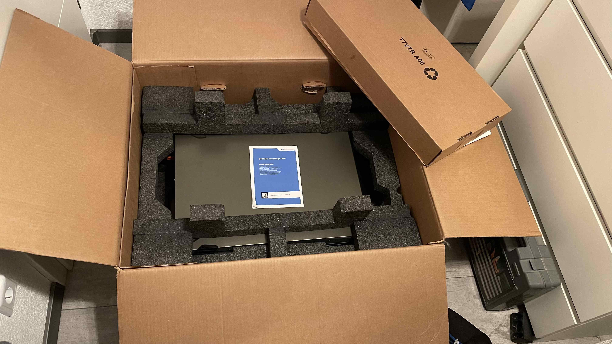
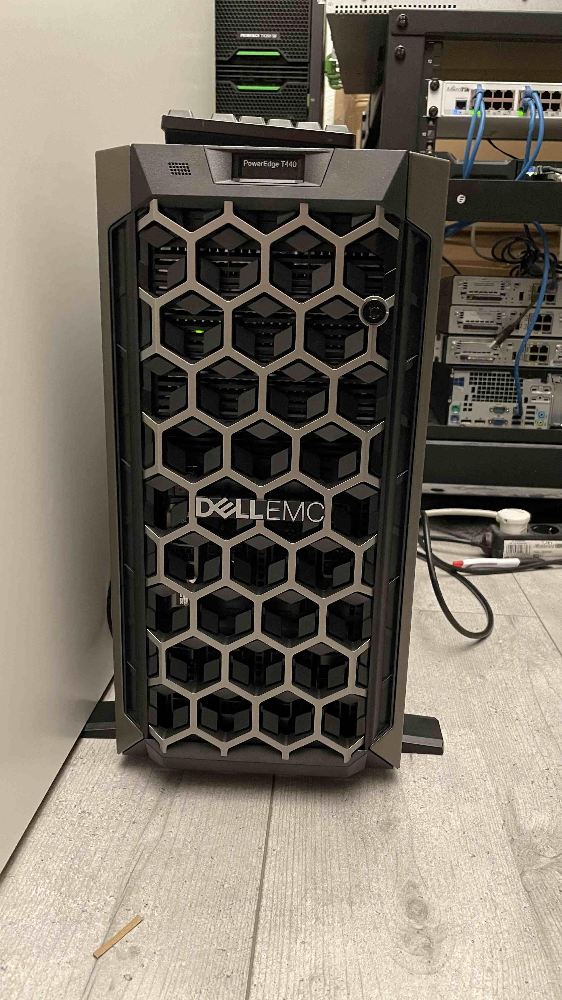
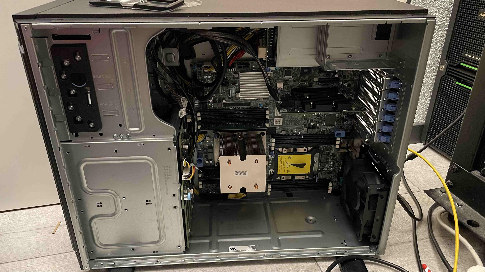
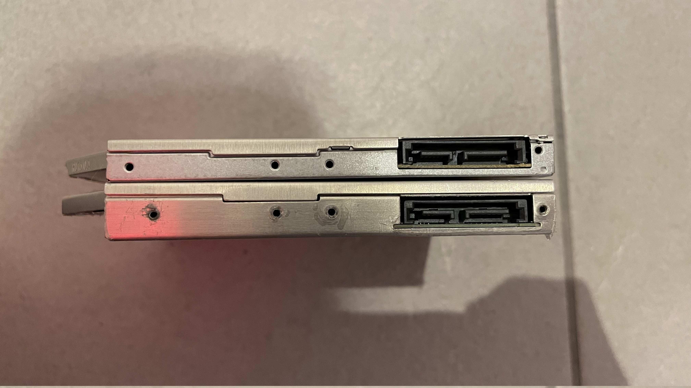
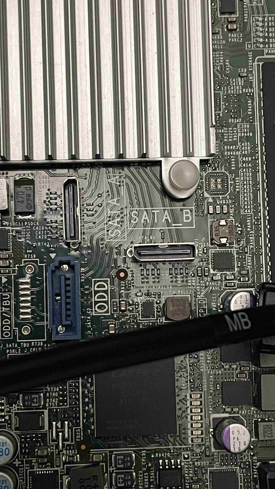

Another part in the ever-evolving Homelab series. Yay! And that after postponing this article for a month. Yay! Let’s see what’s new.

The attentive reader will already have noticed that the title may contain a hint towards what I bought. To everyone else: It’s an DellEMC PowerEdge T440.

The last part of the Homelab series ended (as often), with me selling everything and running all my stuff on a poor Synology DS218+, the cheapest x86-based one at its time.This actually works well, but it’s getting kind of slow and storage is running low.

For the last months I was on a server-hunting tour, checking every eBay and eBay Kleinanzeigen (Germany’s version of classified ads/Craigslist) listing I could find. I didn’t even know exactly what I wanted, my main criteria were:

*   As quiet as possible
*   Energy efficient (DDR4 minimum)
*   Under 1000€
*   Remote management
*   Space for enough 3.5” disks (8 minimum)

This left me with Dell, HP, Fujitsu and Supermicro. After some research I concluded that HP will spin up it’s fans at every possible moment, while the gen 13+ Dell’s are supposedly fairly quiet. I looked up a few models and found an interesting R530 on eBay Kleinanzeigen for around 1100€ (IIRC). This was a little outside of my price range, so I was hesitant and that actually paid of: A few weeks later, a T440 popped up, and it seemed perfect: 770€, 1 Xeon Silver 4208, 16gb of RAM, unused and in original packaging, around 2.5h away from where I live. Almost too cheap to be true, as according to the Dell shop, a single one would cost upwards of 3000$. One December evening I bit the bullet and drove there, only to find the server exactly as promised, for the perfect price. The seller even gave me an additional stick of RAM and a Dell Enterprise SSD.

Let’s go over some aspects:

## Rack Mounting

This is a Tower server (as the T in T440 suggests).

I have a rack.

This is not a great combination.

Luckily there is a nice thing called a [Dell Tower To Rack Conversion Kit](https://www.dell.com/en-sg/work/shop/dell-tower-to-rack-conversion-kit-customer-kit/apd/770-bcol/networking) (and no I do not know why it only exists on Dell Signapore). Sadly, this is relatively expensive, especially since it doesn’t even come with the actual rails. It’s only a new faceplate with a horizontal mount for the info panel and the handles to pull the server out of the rack. Naturally I was wondering on how to actually mount the server in a rack until I found [this video](https://www.youtube.com/watch?v=wKYXImJ7rlk) from the T440’s big brother, the T640. It turns out the mounting screws already exist in the normal T440/T640, they are underneath the top cover which is easily removable.

So I searched for the actual rails through the [DellEMC™ Enterprise Systems Rail Sizing and Rack Compatibility Matrix](https://i.dell.com/sites/csdocuments/Business_solutions_engineering-Docs_Documents/en/rail-rack-matrix.pdf). The only ones that fit my server are the DellEMC C2 ReadyRails II. I believe they have Dell PN 5N9DY or maybe HD9VM, although I cannot be sure as according to Dell.com, they don’t exist. A quick ebay search shows a set costing at least 120€. Oof. For now, the server is laying on a rack shelf. 10€.

## Noise

The noise production was the most important argument in the server selection process. As the T440 is a tower server, it is fairly quiet even without further configuration. After all, there only are two fans installed: One in the PSU (not noticeable) and one in the back (as loud as a usual desktop fan). Quiet, but it is possible to get it to be even more quiet.

I’ve read previously that the fans can be controlled through ipmitool, the basic syntax for Dell’s fan control can be found [on GitHub](https://github.com/ipmitool/ipmitool/issues/30).

This did not work. It didn’t take long to find out that [Dell just disabled that feature](https://www.dell.com/community/PowerEdge-Hardware-General/Dell-ENG-is-taking-away-fan-speed-control-away-from-users-iDrac/m-p/7441702/highlight/true#M63050). Why? I don’t know, but it is possible to get it back through downgrading the iDrac. The last version where manual fan control is supported is 3.30.30.30, you can even get it on the official website: [https://www.dell.com/support/home/en-us/drivers/driversdetails?driverid=g6w0w&oscode=biosa&productcode=poweredge-t440](https://www.dell.com/support/home/en-us/drivers/driversdetails?driverid=g6w0w&oscode=biosa&productcode=poweredge-t440)

But wait! Downgrade failed! It turns out Dell changed the signing certificates in-between the current version and 3.30.30.30. A known issue according to [Dell Knowledge Base Article 000190151](https://www.dell.com/support/kbdoc/en-us/000190151/idrac9-firmware-downgrade-failures-rac0181). Just downgrade to [version 4.40.10.0](https://www.dell.com/support/home/en-us/drivers/driversdetails?driverid=mgd5f&oscode=biosa&productcode=poweredge-t440) in-between and get back your beloved fan control.

The newly-acquired manual fan control is so manual that you can even turn off the fan. This is not advisable. I put my fan to 0x08, and while being inaudible (a single external HDD is louder than the whole server), it stays under 48°C under load on a single Xeon Silver 4208. You’ll probably have to experiment a little for yourself, but this is my preferred fan speed.

## Disks

Disks. They are expensive and the recent Chia-coin did in fact not help. My disks of choice for this project are Western Digital Red 12Tb, mainly because they are quiet and they aren’t too expensive. While they are 320+€ usually, you can buy WD Elements/MyBook external hard drives and [shuck](https://www.howtogeek.com/324769/how-to-get-premium-hard-drives-for-cheap-by-shucking-external-drives/) them to get the WD Reds (or white-labelled WD Reds) that are inside. The external ones usually cost 220€ around here, but you can get them for 180€ if you are lucky. I was not lucky yet, but am hunting for good sales.

I already got a single WD Elements, and shucking ti was extremely easy thanks to the [iFixIt guide](https://www.ifixit.com/Guide/How+to+Shuck+a+WD+Elements+External+Hard+Drive/137646). After that you should run badblocks, but beware, a single run takes multiple hundreds of hours per 12Tb.

## Using it

I already flashed the RAID controller - a Dell PERC H330 - to IT mode/HBA mode, using [this awesome guide from Sleyk on ServeTheHome](https://forums.servethehome.com/index.php?threads/flash-crossflash-dell-h330-raid-card-to-hba330-12gbps-hba-it-firmware.25498/) at this point. There’s not much to say about this, worked like a charm, nothing complicated.

The first, naive, plan was the usual ESXi with emulated and passed-through HBA, this posed a problem though: I’d have to store ESXi and the FreeNAS VMDK somewhere, but all disk slots would be forwarded to the VM already. There would have been two options: An ODD to 2.5” adapter, and a SATA-DOM (or at least the on-disk-ports).

The ODD conversion did not work:

Wrong screw placements and too high to fit.

The onboard SATA ports were a hoax too:

Appearantly this is called Oculink-2 (even though it clearly says “SATA”), and a converter is neither cheap nor a nice solution.

After that disappointment I just went a different, more professional direction: I installed a proper Linux distribution. The options were Rocky Linux, Debian or openSuse Leap; I went with Rocky Linux just because my desktop and laptop run Fedora and the “sudo dnf” and some distribution-specific paths are basically muscle memory. Next step: Installing ZFS. Nothing difficult either, just copy the commands from the [OpenZFS Docs](https://openzfs.github.io/openzfs-docs/Getting%20Started/RHEL-based%20distro/index.html). One important thing to note is their section on [performance tuning](https://openzfs.github.io/openzfs-docs/Performance%20and%20Tuning/Workload%20Tuning.html), which I hope to implement later.

With ZFS installed, I had to decide on how to configure it next. I slowly wanted to switch away from virtual machines. While they would go quite nice hand-in-hand with ZFS ZVOLs, are very versatile and offer a nice web interface through the Cockpit project, they do not offer too much in terms of infrastructure-as-code. One idea was running Docker or K3S alongside libvirt, but that just didn’t “feel right”.

The currently planned solution: Hashicorp Nomad. And since I want to do things right this time I hope to go with an installation and configuration through Ansible and secrets management through Hashicorp Vault (and also use Hashicorp Consul). If even Cloudflare and Roblox use it, it cannot be bad, right? Also, let’s do a hybrid cloud with the free Oracle Cloud Instances and Tailscale just because why not? It makes things way more complicated, but isn’t that the reason we are here for?

But this is something I promised myself to start only _after_ publishing this exact post right here.
