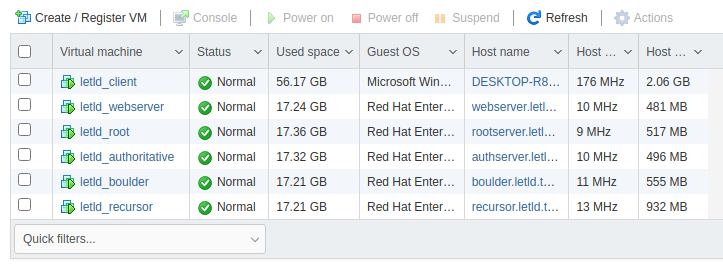
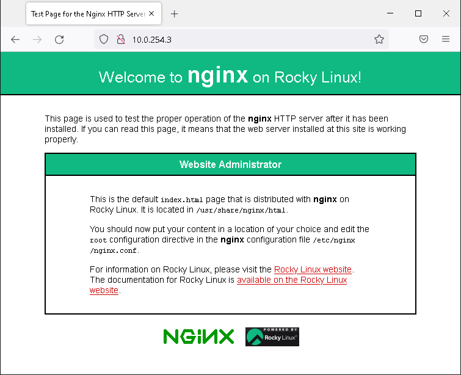

This is meant to be a follow-up to my post about [Alternative DNS Roots](https://scholz.ruhr/blog/alternative-dns-root). In that article we set up a DNS resolver that resolves a new, custom TLD because we decided we do not trust our current registrar. There's also some more information about how DNS works in there. At that point I noted that we did not set up a "real alternative DNS root":

> To have a true alternative DNS root, we would have to replace our single resolving DNS server with two servers: One that uses some other Root Servers, and one that acts as Root Server. The result would mostly be the same, except for the fact that other people could easily set up DNS resolvers that point to our Root Server.

Let's fix this. The last post contained some vague chapters, you can look at this article as an extended, improved version.

## Flashback

If you've already know DNS or have read the old article you can safely [skip this chapter](#heading-working-environment), as it is mostly adapted from there.

Can you really trust your domain registrar? After all they could at any point decide to just delete your domain. A solution? Becoming your own registrar. But since all TLDs are already being managed by somebody, and registering a new gTLD would [set you back around US$185,000](https://newgtlds.icann.org/en/applicants/global-support/faqs/faqs-en):

> The evaluation fee is US$185,000. Applicants will be  required to pay a US$5,000 deposit fee per requested application slot when  registering. The deposit will be credited against the evaluation fee. Other  fees may apply depending on the specific application path. See the section 1.5 of the [_Applicant Guidebook_](https://newgtlds.icann.org/applicants/agb) for  details about the methods of payment, additional fees and refund schedules.

And even if you opt for that option, in theory ICANN could delete your TLD as they wish.

## DNS Crash Course

Another, way more interesting solution is the creation of an _alternative DNS root_. Since DNS is a distributed protocol, all (global) DNS requests start at the [Root Servers](https://www.iana.org/domains/root/servers) (the IP addresses of the Root Servers themselves are needed to bootstrap the process and are usually being packaged with the DNS software you use in the [Root Hints File](https://www.iana.org/domains/root/files)). For example, if you wanted to request `scholz.ruhr`, the first step in resolving this domain is finding out how to resolve `.ruhr` domains:

```dns
; dig scholz.ruhr +trace

; <<>> DiG 9.16.24-RH <<>> scholz.ruhr +trace
;; global options: +cmd
.                       86426   IN      NS      a.root-servers.net.
.                       86426   IN      NS      b.root-servers.net.
.                       86426   IN      NS      c.root-servers.net.
.                       86426   IN      NS      d.root-servers.net.
.                       86426   IN      NS      e.root-servers.net.
.                       86426   IN      NS      f.root-servers.net.
.                       86426   IN      NS      g.root-servers.net.
.                       86426   IN      NS      h.root-servers.net.
.                       86426   IN      NS      i.root-servers.net.
.                       86426   IN      NS      j.root-servers.net.
.                       86426   IN      NS      k.root-servers.net.
.                       86426   IN      NS      l.root-servers.net.
.                       86426   IN      NS      m.root-servers.net.
;; Received 447 bytes from 127.0.0.53#53(127.0.0.53) in 14 ms

ruhr.                   172800  IN      NS      anycast10.irondns.net.
ruhr.                   172800  IN      NS      anycast24.irondns.net.
ruhr.                   172800  IN      NS      anycast9.irondns.net.
ruhr.                   172800  IN      NS      anycast23.irondns.net.
ruhr.                   86400   IN      DS      25131 10 2 EC453960C396742EFA2EF815FA9C9DBA146E838F86F11643704C1630 424F4E78
ruhr.                   86400   IN      RRSIG   DS 8 1 86400 20220221050000 20220208040000 9799 . ceKYMW9vs5SbFYqLy98Xl66zbKTgFtovH70y6EKzhw/wVNT5/U7lbk+y oaxXXthJU4omaLo8WlWUDjbeS00SF3lKQQQDM0QRCidNO2DVX+sqXdQd xINTySj6sQQG/TlGTn0jqf9YzbXoBYcthaaMcpv1B6CyKZ1T9xkyps3i kQI0y6KTfZGjTDh4RO/XUv7y9CiG8wK5d/C30/MPTWdzXoYYUscBvlAs hAq/x/MyCpNbn0BvL1VxwUU7JBnDmrWLk7IUWdhxnj7z+LWDFMog1fzp dPThPGCXgla6nNmPI4qvfDk91UnGqn4sDYFr8m0OQygAb/qcGcaF35R0 lGWZaA==
;; Received 685 bytes from 192.33.4.12#53(c.root-servers.net) in 24 ms
```

As you can see, the first request goes to the Root Servers to find out how to resolve `.ruhr` domains. In this case, `c.root-servers.net` forwards our client to some name servers hosted under the `irondns.net` domain. Afterwards, the resolving continues recursively as usual:

```dns
scholz.ruhr.            86400   IN      NS      freedns1.registrar-servers.com.
scholz.ruhr.            86400   IN      NS      freedns4.registrar-servers.com.
scholz.ruhr.            86400   IN      NS      freedns2.registrar-servers.com.
scholz.ruhr.            86400   IN      NS      freedns3.registrar-servers.com.
l6bto0gpvkt1s0jh9gmnf0l0g4n8k71k.ruhr. 43200 IN RRSIG NSEC3 10 2 43200 20220221140744 20220207140744 45611 ruhr. IBSIFyyuqS4ROf3GS13pZ86jq3UFW8boZg5epISGrqC/Hjz9pq6fHiN2 5xxSJlk1iTWRigE2PxpshKnhSxx+TJLoR0/IBDew2f68h/dS98tDrSqm rkNNN+Wl0H1NbXZAIPQtaHW/jCBzfj4WLHuqQm6q4DMgOFqV8m+gxR1T NavId6mO+3S3PVet8z7jsA8P6bY0gafUI9y4DQfQ+AYfJg==
l6bto0gpvkt1s0jh9gmnf0l0g4n8k71k.ruhr. 43200 IN NSEC3 1 0 0 - L6D37JCCS58BI7A2990T53UQ19D2G87J NS
;; Received 423 bytes from 195.253.64.12#53(anycast10.irondns.net) in 19 ms

scholz.ruhr.            300     IN      A       76.76.21.21
;; Received 56 bytes from 195.154.94.174#53(freedns3.registrar-servers.com) in 29 ms
```

The Root Servers hold a list of all TLDs authoritative name servers. You can download them [from InterNIC](https://www.internic.net/domain/root.zone) and they even let you send AXFR requests to some Root Servers, so you could also download a list of all TLD nameservers through dig: `dig AXFR . @lax.xfr.dns.icann.org`

### Alternative DNS Roots

Back to the registrar thing: How do you become a registrar (for free)? In theory you could replace the Root Hints file on all of your clients. This is cumbersome (if not impossible, think about phones, game consoles, …) to say the least. Another, way easier option is to use a DNS server that has a “modded” Root Hints File that resolves all of your own TLDs and falls back to the official ones for normal domains. That way, you just have to point your clients to a new DNS server, which almost every client supports. There already are providers that offer you such servers, one example is [OpenNIC](https://www.opennic.org/). But using someone else’s servers is boring, so let’s set this up ourselves.

## Working environment

Since I'm going to use a lot of different servers everything that follows is running on an ESXi 7.0 host (a Dell PowerEdge R330), all machines are in the `10.0.254.0/24` subnet. You could run everything on a single computer or even a single VM, but this way I can say the money for the servers was worth it.

## Machines

The plan is to use the following machines:
* Test Client Machine (Windows 10, `10.0.254.2`)
* Test web server (Rocky Linux 8, `10.0.254.3`)
* DNS root server (Rocky Linux 8, `10.0.254.4`)
* DNS authoritative server for our TLD (Rocky Linux 8, `10.0.254.5`)
* VM to issue certificates automatically (Rocky Linux 8, `10.0.254.6`)
We won't use this one in this article, but a future one.
* DNS resolver (Rocky Linux 8, `10.0.254.7`)

You could combine the root server and the authoritative server but VMs cost nothing and we'll do things right this time around.

## Getting Started

Installing the VMs. This can take a while if you haven't got some automation and templates set up, an SSD helps too. Of course I have none of those on that server.



On the client we install some browsers, and on our web server we install Nginx. Remember to open the local firewall. So far so good.




For the root server, the authoritative server and the recursor (yes, all three) we need bind installed, opened up, and started up: 

```console
dnf in bind -y
firewall-cmd --add-port=53/udp --zone=public --permanent
firewall-cmd --reload
vi /etc/named.conf # Edit listen-on and allow-query
systemctl enable --now named
```

## Root Server

What does the root server have to do? Serve information about where to find the respective name servers for all TLDs. Say you wanted to access `scholz.ruhr`: The first request goes to the root servers to find out who is responsible for all domains under the `.ruhr` TLD, as mentioned earlier.

The easy-to-parse zone file of all TLDs can be retrieved via `dig AXFR . @lax.xfr.dns.icann.org` or just downloaded from [InterNIC](https://www.internic.net/domain/root.zone):

```console
wget https://www.internic.net/domain/root.zone -O /etc/named/root.zone
```

Usually, the file served from the bind package would be used. This is unfavorable in our use-case, since an OS update could overwrite it at any point after we added some custom content to it. We also have to configure the server to actually use and serve this file. Remove the default root hints from the config file:

```console
//zone "." IN {
//        type hint;
//        file "named.ca";
//};
```

And replace it with our downloaded file:

```console
zone "." IN {
        type master;
        file "/etc/named/root.zone";
};
```

While we're at it we also disable the recursion - we don't need it since we only want to serve the root zone.

Restart the server and try it out:

```dig
; dig scholz.ruhr @10.0.254.4

; <<>> DiG 9.16.24-RH <<>> scholz.ruhr @10.0.254.4
;; global options: +cmd
;; Got answer:
;; ->>HEADER<<- opcode: QUERY, status: NOERROR, id: 47187
;; flags: qr rd; QUERY: 1, ANSWER: 0, AUTHORITY: 4, ADDITIONAL: 9
;; WARNING: recursion requested but not available

;; OPT PSEUDOSECTION:
; EDNS: version: 0, flags:; udp: 1232
; COOKIE: 23a0609fabab44649e24446b6200807f747102977dc3d151 (good)
;; QUESTION SECTION:
;scholz.ruhr.                   IN      A

;; AUTHORITY SECTION:
ruhr.                   172800  IN      NS      anycast24.irondns.net.
ruhr.                   172800  IN      NS      anycast23.irondns.net.
ruhr.                   172800  IN      NS      anycast9.irondns.net.
ruhr.                   172800  IN      NS      anycast10.irondns.net.

;; ADDITIONAL SECTION:
anycast9.irondns.net.   172800  IN      A       195.253.64.11
anycast10.irondns.net.  172800  IN      A       195.253.64.12
anycast23.irondns.net.  172800  IN      A       195.253.65.11
anycast24.irondns.net.  172800  IN      A       195.253.65.12
anycast9.irondns.net.   172800  IN      AAAA    2a01:5b0:4::b
anycast10.irondns.net.  172800  IN      AAAA    2a01:5b0:4::c
anycast23.irondns.net.  172800  IN      AAAA    2a01:5b0:5::b
anycast24.irondns.net.  172800  IN      AAAA    2a01:5b0:5::c

;; Query time: 0 msec
;; SERVER: 10.0.254.4#53(10.0.254.4)
;; WHEN: Mon Feb 07 02:14:51 CET 2022
;; MSG SIZE  rcvd: 350
```

It only serves the TLD NS records themselves, as it should.

## Authoritative Server

First of all, disable recursion in the config file. Afterwards, we add our custom `.scholz` zone to the config file:

```console
zone "scholz" IN {
        type master;
        file "/etc/named/zones/db.scholz";
};
```

In the zone file (`/etc/named/zones/db.scholz`) itself, we'll just put our new fancy test web server and the name server itself:

```dig
@        IN      SOA     ns1.scholz. admin.scholz. (
                  3     ; Serial
             604800     ; Refresh
              86400     ; Retry
            2419200     ; Expire
             604800 )   ; Negative Cache TTL

        IN      NS      ns1.scholz.
ns1.scholz.    IN    A    10.0.254.5
www.scholz.    IN    A    10.0.254.3
```

It is a **terrible idea** to use my name as TLD, as the ICANN could decide to create a `.scholz` gTLD (I wish) or maybe some other person already uses that name as an internal TLD. They are not reserved after all, so anything is possible.

Restart the service and test it out:

```dig
; dig www.scholz. @10.0.254.5

; <<>> DiG 9.16.24-RH <<>> www.scholz. @10.0.254.5
;; global options: +cmd
;; Got answer:
;; ->>HEADER<<- opcode: QUERY, status: NOERROR, id: 26297
;; flags: qr aa rd; QUERY: 1, ANSWER: 1, AUTHORITY: 1, ADDITIONAL: 2
;; WARNING: recursion requested but not available

;; OPT PSEUDOSECTION:
; EDNS: version: 0, flags:; udp: 1232
; COOKIE: 0200e5aeb44d715408e2dbd3620083948e103c4665cfb578 (good)
;; QUESTION SECTION:
;www.scholz.                    IN      A

;; ANSWER SECTION:
www.scholz.             604800  IN      A       10.0.254.3

;; AUTHORITY SECTION:
scholz.                 604800  IN      NS      ns1.scholz.

;; ADDITIONAL SECTION:
ns1.scholz.             604800  IN      A       10.0.254.5

;; Query time: 1 msec
;; SERVER: 10.0.254.5#53(10.0.254.5)
;; WHEN: Mon Feb 07 02:28:01 CET 2022
;; MSG SIZE  rcvd: 117
```

First success!

## Adding the Auhtoritative Server to the Root Server

Most of the work is done, now we have to add our .scholz name server to the root zone. We append the `root.zone` file from earlier:

```dns
; <<< snip >>>
scholz.       172800   IN   NS   ns1.scholz.
ns1.scholz.   172800   IN   A   10.0.254.5
```

Aaand reload the service. Next test:

```dns
; dig www.scholz. @10.0.254.4

; <<>> DiG 9.16.24-RH <<>> www.scholz. @10.0.254.4
;; global options: +cmd
;; Got answer:
;; ->>HEADER<<- opcode: QUERY, status: NOERROR, id: 22390
;; flags: qr rd; QUERY: 1, ANSWER: 0, AUTHORITY: 1, ADDITIONAL: 2
;; WARNING: recursion requested but not available

;; OPT PSEUDOSECTION:
; EDNS: version: 0, flags:; udp: 1232
; COOKIE: ca910e5594d7ba5c33dcf60562008a896d4992750884eea0 (good)
;; QUESTION SECTION:
;www.scholz.                    IN      A

;; AUTHORITY SECTION:
scholz.                 172800  IN      NS      ns1.scholz.

;; ADDITIONAL SECTION:
ns1.scholz.             172800  IN      A       10.0.254.5

;; Query time: 2 msec
;; SERVER: 10.0.254.4#53(10.0.254.4)
;; WHEN: Mon Feb 07 02:57:42 CET 2022
;; MSG SIZE  rcvd: 101
```

It shows where to find the authoritative name server. Perfect.

## Resolver

What do we have to do to get the resolver up and running? Not much. (I thought) The hard work is already done, we just have to replace the root hints - the file that tells the resolver where to start the lookup - with a list of our own root servers. For reference, the "normal" root hints file can be found at `/var/named/named.ca` (on RHEL-based systems at least) or again at [InterNIC](https://www.internic.net/domain/named.root), but we won't need it.

In the config file, we leave recursion enabled for once, and replace the root hint file path `named.ca` with a custom `/etc/named/custom_named.ca`. That file now looks like this:

```dns
.                               518400  IN      NS      fake.root-servers.net.
fake.root-servers.net.          518400  IN      A       10.0.254.4
```

Don't forget to disable DNSSEC via the `dnssec-enable` flag, otherwise you will run into `SERVFAIL` errors.

Restart the service and test, big surprise, it doesn't work. It still uses the default root servers, even after I attempted to even delete that file. An hour of troubleshooting later and it turns out, [BIND itself contains root hints in its source code](https://github.com/isc-projects/bind9/blob/main/lib/dns/rootns.c). I have not yet found a way to circumvent this behavior (apart from recompiling the whole thing), the only document I could find that even talks about this issue is the [ISC root hints FAQ](https://kb.isc.org/docs/aa-01309). I am thankful for any pointers on how to do this the "right" way.

There seem to be two obvious workarounds:
1. Use a different resolver (like PowerDNS)
2. Serve the customized root zone on the resolver itself (as it does not change often and can automatically be refetched)

Since I've invested way too much work into getting BIND to work, I'll go with option 2. Set up the resolver to server zone "." from a custom file:

```console
zone "." IN {
        type master;
        file "/etc/named/root.zone";
};
```

Serving the root zone prevents BIND from getting to the included root hints.

Afterwards, append the information about our root server to the root zone file we downloaded to `/etc/named/root.zone`:

```dig
.                       86400   IN      SOA     a.root-servers.net. nstld.verisign-grs.com. 2022020701 1800 900 604800 86400

; <<<snip>>>

scholz.                 1       IN      NS      ns1.scholz.
ns1.scholz.             1       IN      A       10.0.254.5
```

Last test:

```dns
; dig www.scholz. @10.0.254.7

; <<>> DiG 9.16.24-RH <<>> www.scholz. @10.0.254.7
;; global options: +cmd
;; Got answer:
;; ->>HEADER<<- opcode: QUERY, status: NOERROR, id: 65520
;; flags: qr rd ra; QUERY: 1, ANSWER: 1, AUTHORITY: 1, ADDITIONAL: 2

;; OPT PSEUDOSECTION:
; EDNS: version: 0, flags:; udp: 1232
; COOKIE: 3e9c05a4d30a782279d47cfa62019fe7edc90a6225925d46 (good)
;; QUESTION SECTION:
;www.scholz.                    IN      A

;; ANSWER SECTION:
www.scholz.             1       IN      A       10.0.254.3

;; AUTHORITY SECTION:
scholz.                 1       IN      NS      ns1.scholz.

;; ADDITIONAL SECTION:
ns1.scholz.             1       IN      A       10.0.254.5

;; Query time: 1 msec
;; SERVER: 10.0.254.7#53(10.0.254.7)
;; WHEN: Mon Feb 07 23:40:39 CET 2022
;; MSG SIZE  rcvd: 117
```

Ignore the 1 second TTL. This is a terrible practice, but quite useful in testing.

The most important thing: It works! Not exactly like we wanted, but it works!

## Client

Change the DNS server to the IP of our resolver, maybe flush the DNS cache. That's it:


Success. You may notice the missing certificate/missing HTTPS. We will take care of this in the some future post.
