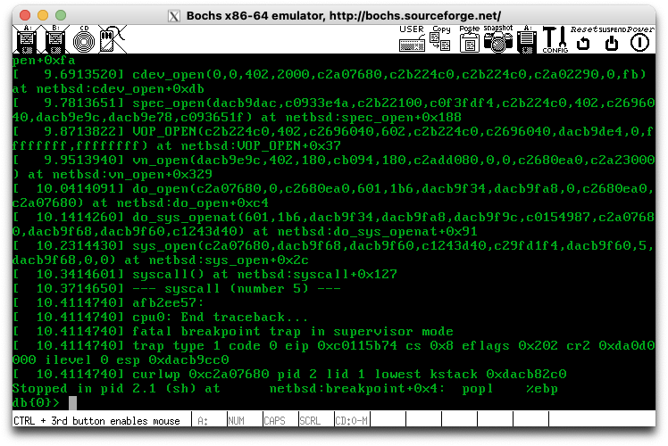
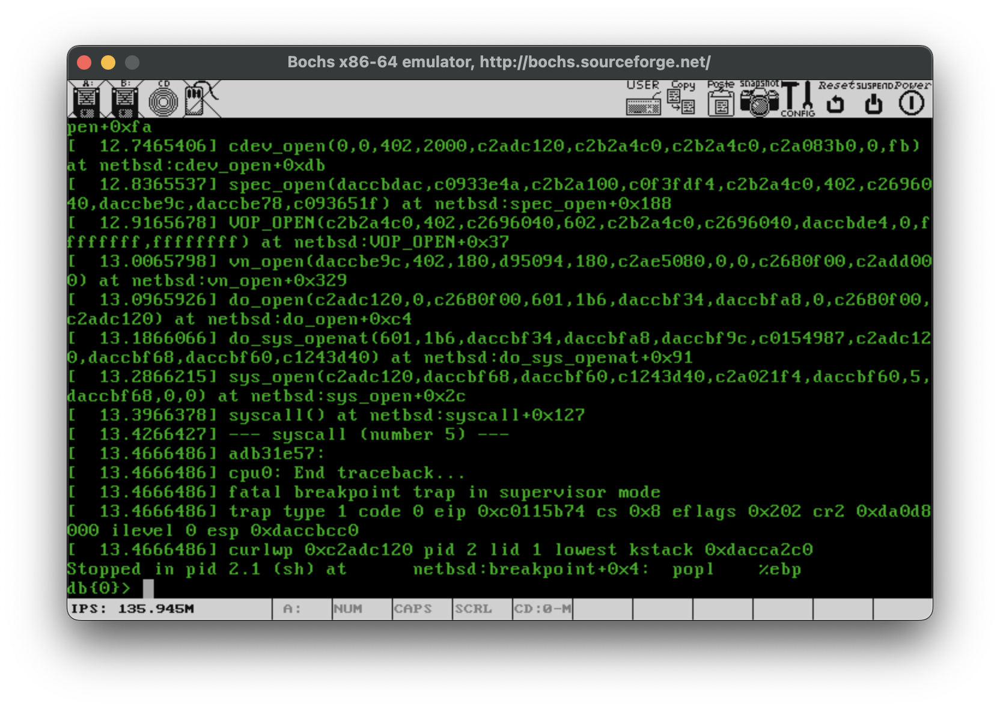
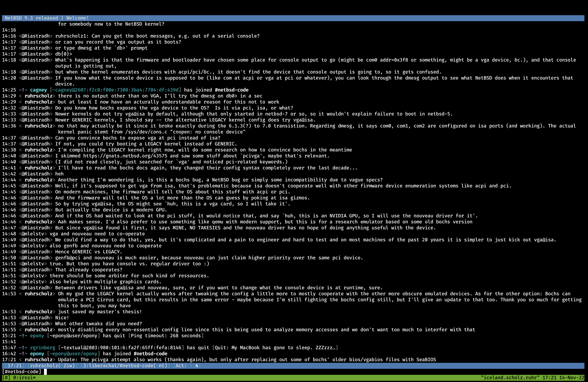
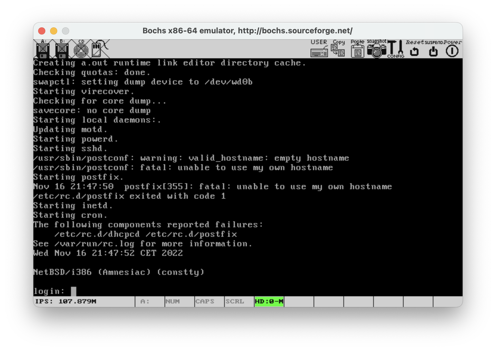
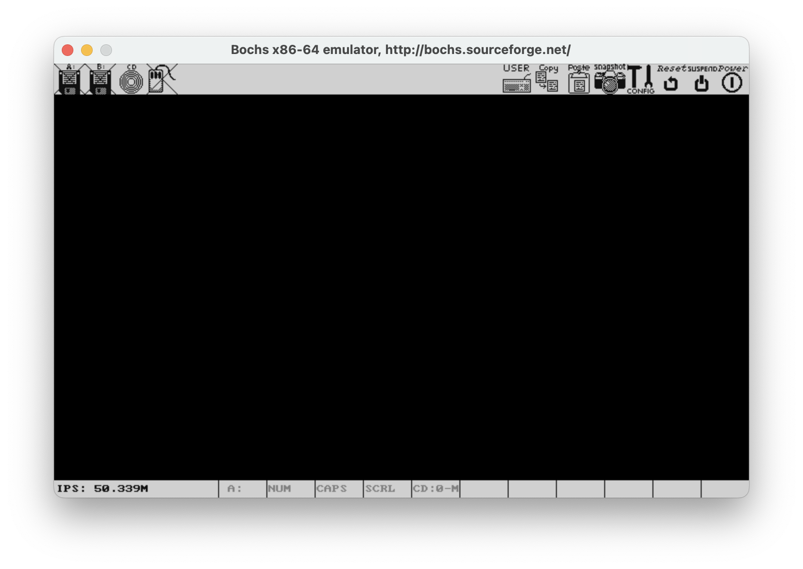
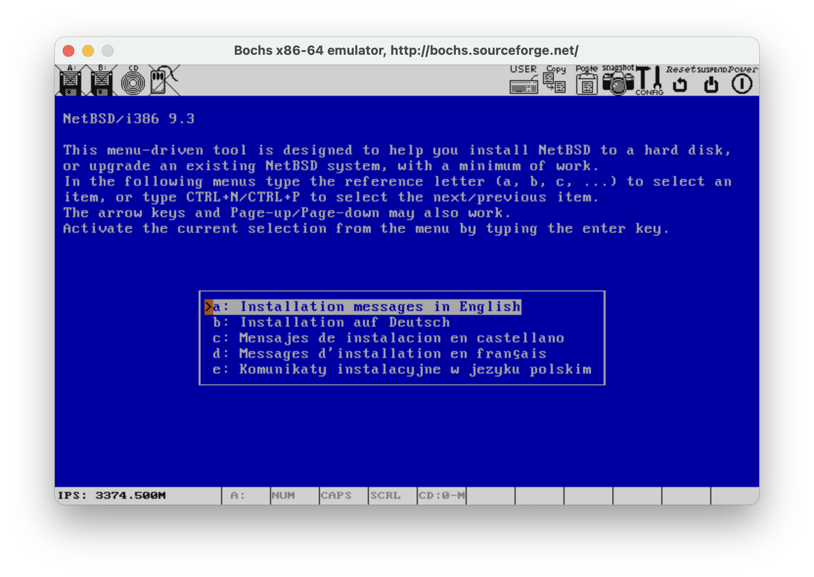

Running NetBSD on Bochs. Sounds trivial. Point Bochs to the right .iso and start it. Right? Wrong. I have to run NetBSD on a forked Bochs version as a prerequisite of my master’s thesis. That already worked with Linux 5.4 and FreeBSD 12.3, so why shouldn’t it work with NetBSD 9.3?

## Prequel

As already stated, my initial goal was to run a recent NetBSD version, 9.3 (released 2022-08-04) in my case, on a customised forked Bochs version (for some low-level analysis further on). The initial attempt - just booting the [NetBSD-9.3-i386.iso](http://cdn.netbsd.org/pub/NetBSD/NetBSD-9.3/iso/NetBSD-9.3-i386.iso) - went like this:



Yes the screenshot was taken over SSH X11 forwarding since the wonderful custom emulator is very particular on what OS it wants to run on.

As you can see, there is a kernel panic, stemming from a strange error message regarding missing console devices.

## First Attempts

My first thought was "Well that sure is some incompatibility between a current NetBSD version and a decade-old forked Bochs". In fact, the Bochs version this research project relies on prints the following on startup:

```console
========================================================================
        FailBochs 1.0.1, based on the Bochs x86 Emulator 2.4.6
             Build from CVS snapshot, on February 22, 2011
                   Compiled at Oct 17 2022, 15:05:41
========================================================================
```

Maybe we should try a more recent Bochs version. I was in the process of downloading the source code onto my Mac when I remembered package managers exist. A simple `brew install bochs` later, and I could test a more recent version:

```console
========================================================================
                        Bochs x86 Emulator 2.7
              Built from SVN snapshot on August  1, 2021
                Timestamp: Sun Aug  1 10:07:00 CEST 2021
========================================================================
```

Still not fully up-to-date, but Bochs development pretty much stagnated and there aren’t any major changes since then. Copy the .iso and the BOCHSRC over to the Mac, run it and…

A bunch of errors since every second Bochs config option changed its name since 2011. After adapting those config parameters, we’re greeted with a familiar image:



Same error as before. One thing you cannot see in this screenshot is, that just above the cutoff the Kernel printed `cnopen: no console device`. A quick grep through the NetBSD Kernel (of which I had 3 copies on my desktop at that point), lead me to `sys/dev/cons.c`:

```c
#if NNULLCONS > 0
	if (cndev == NODEV) {
		nullconsattach(0);
	}
#else /* NNULLCONS > 0 */
	if (cndev == NODEV) {
		/*
		 * This is most likely an error in the console attach
		 * code. Panicking looks better than jumping into nowhere
		 * through cdevsw below....
		 */
		panic("cnopen: no console device");
	}
#endif /* NNULLCONS > 0 */
```

This helpful comments tells us to just check elsewhere in the architecture specific code. Mind you, at this point I didn’t even had a clue what they meant with console. Serial console? VGA? Such a word could mean almost anything

## Online Search

My initial though was: Let’s check Google. I cannot be the only one with this problem. And that was true, I wasn’t, there was a single mention of the same bug out there. The helpful [NetBSD Problem Report #43575](https://gnats.netbsd.org/43575) describes the exact problem I’m having right now. The bad news? It was opened in 2010, and the only update links to a tweet from 2018 stating that this still isn’t fixed. Off to a great start…

## Binary Search

I tried some other NetBSD versions, just to make sure this wasn’t a different, more recent bug. The result? NetBSD 6.1.3 and older boot up, NetBSD 7.0 and newer do not (which doesn’t really make sense since the bug report talks about version 5.1). Finding that out was more annoying than expected, since some of the NetBSD archive mirrors were down for Europe.

## Source Code

Now having a rough outline of when this issue was introduced, I loaded the NetBSD repo into Bootlin’s Elixir, searched for the files that changed in that months, and came back empty handed. A good portion of the device initialization code was rewritten in that time, which did not make the search any easier. I spent about a week just replacing files with older ones and hope those would work. They did not.

## IRC

At this point I was about 2 weeks deep into this problem. I’ve compared hundreds of files between the working and non-working NetBSD versions and almost was ready to give up. Then I remembered there is a #netbsd-code channel on libera.chat. I’ve disregarded this previously since there hasn’t been a single message since I’ve joined (weeks, maybe months ago), but I was desperate enough to try my luck anyways. I could not believe my eyes when in literal seconds there were multiple responses, with multiple ideas to fix this issue:



You can read for yourself if you want, but it basically boils down to two one issue: Newer NetBSD Kernels do not search for a (VGA) screen on ISA ports anymore (since that is really obsolete) and has mostly been replaced with ACPI and PCI devices for displaying video output. So now I have two options: Use the `LEGACY` Kernel config which still searches for VGA displays on ISA ports (and of which I have no clue why I haven’t tried that earlier) and using something PCI-based for graphics in Bochs.

## LEGACY

Well, why didn’t I try this earlier? No idea, I probably was distracted by getting my own custom Kernel and Kernel config to work. So a quick compile of the LEGACY Kernel (which compiles really quickly on the M2 MacBooks), rsync it onto a NetBSD VM, and start it up in Bochs:




The most beautiful thing I have ever seen. But using the LEGACY kernel, while it works, isn’t ideal. Especially since I’d have to edit my own Kernel config. Let’s try the PCI options.

## Cirrus

Searching for “Bochs PCI VGA” yields this result: [https://bochs.sourceforge.io/doc/docbook/user/cirrus-notes.html](https://bochs.sourceforge.io/doc/docbook/user/cirrus-notes.html). So there is VGA over PCI, through an emulated Cirrus GPU. I’ve enabled the Cirrus config options in my BOCHSRC through

```console
# Enable CL-GD5446 PCI
vga: extension=cirrus
vgaromimage: file=$BXSHARE/VGABIOS-lgpl-latest-cirrus
pci: enabled=1, chipset=i440fx, slot1=cirrus
```

(and disabling the previous options), [downloaded the Cirrus VGA BIOS](https://www.nongnu.org/vgabios/), and was ready to see a perfectly starting system… but:



Black screen. Why doesn’t this work? No clue (and am happy for any answers).

> Edit from the future (2023-02-12): It works with the BIOS files bundled with the Bochs installation for most distros (tested Arch and MacOS).

### SeaBIOS

Luckily, while searching for other BIOS files I stumbled upon [https://bochs.sourceforge.io/doc/docbook/user/rom-images.html](https://bochs.sourceforge.io/doc/docbook/user/rom-images.html). Appearantly, modern Bochs has support for SeaBIOS files (including VGABIOS)! Of course, my Bochs came without those BIOS files, and SeaBIOS does not distribute ready-made binaries for the SeaVGABIOS. At least compiling it from source is *extremely* easy: [https://www.seabios.org/SeaVGABIOS](https://www.seabios.org/SeaVGABIOS). I ended up with two files, `bios.bin` and `vgabios.bin`. Plugging those into our Bochs config yields:


And a little while later…



The ultimate success, a stock NetBSD 9.3 i386 .iso booting in (modern) Bochs! If you only are interested in getting NetBSD to run in modern Bochs, you may stop reading now, but I am not finished yet.

## Bonus: PCIVGA

Now, if you recall, my initial goal was to run NetBSD 9.3 on an older, forked Bochs version. And I thought I could just use my newly compiled SeaBIOS and SeaVGABIOS files to do that. I went ahead, changed the config options some more because the syntax changed, started it up and was greeted with a blank screen. Again. No video. Seems like the older Bochs version wasn’t yet compatible with SeaBIOS, and for some reason the supplied Bochs Cirrus VGABIOS did not work either. I was getting desperate again, I was so close to getting this to work, and was foiled again.

But: While randomly changing BOCHSRC options, I noticed those few lines of comments:

```console
#=======================================================================
# I440FXSUPPORT:
# This option controls the presence of the i440FX PCI chipset. You can
# also specify the devices connected to PCI slots. Up to 5 slots are
# available now. These devices are currently supported: ne2k, pcivga,
# pcidev, pcipnic and usb_ohci. If Bochs is compiled with Cirrus SVGA
# support you'll have the additional choice 'cirrus'.
#
# Example:
#   i440fxsupport: enabled=1, slot1=pcivga, slot2=ne2k
#=======================================================================
#i440fxsupport: enabled=1, slot1=cirrus
```

I checked again and those definitely were not in the modern Bochs configs. Still being desperate, I tried that PCIVGA option (which is not available on the modern version!), and what do you know, it worked. I spent multiple weeks getting this to work, tried recompiling every bit of ACPI/PCI init code and the solution was to just add `i440fxsupport: enabled=1, slot1=pcivga` to the old config file. And I still don’t know why they removed that option in the last decade or why the normal VGABIOSs don’t work.
