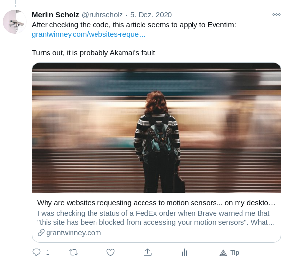

The first post of 2021. Right now I am sitting here, rewriting this entire blog, and stumble upon the problem of OpenGraph and Twitter images.

What are OpenGraph images you may ask. Let's dive into OpenGraph itself first. [OpenGraph](https://ogp.me/) is a protocol to specify easily crawlable metadata in your website. It consists of ```html <meta>``` tags in the head of your website. The OpenGraph data of this page right now should look like this:

<!--more-->

```html
<meta property="og:title" content="OpenGraph images on-the-fly">
<meta property="og:description" content="The first post of 2021. Right now I am sitting here, rewriting this entire blog, and stumble upon the problem of OpenGraph and Twitter images.
What are OpenGraph images you may ask. Let’s dive into OpenGraph itself first. OpenGraph is a protocol to specify easily crawlable metadata in your website. It consists of html <meta> tags in the head of your website. The OpenGraph data of this page right now look like this:">
<meta property="og:type" content="article">
<meta property="og:url" content="https://scholz.ruhr/post/dynamic-og-images/">
```

A little bit recursive!

The OpenGraph protocol is widely used in social networks, to get those funny little "link previews" you may know from Facebook, Twitter, etc. Here is a screenshot of an example from my Twitter feed:



It would be immensely difficult to write a parser that automatically fetches the feature image, article title, and summary of every possible website, so Facebook created this protocol to help us developers.

If you remember the intro correctly, I also wrote Twitter images. See, Twitter has its own protocol for this, which is pretty similar. Take a look:

```html
<meta name="twitter:card" content="summary">
<meta name="twitter:title" content="OpenGraph images on-the-fly">
<meta name="twitter:description" content="The first post of 2021. Right now I am sitting here, rewriting this entire blog, and stumble upon the problem of OpenGraph and Twitter images.
What are OpenGraph images you may ask. Let’s dive into OpenGraph itself first. OpenGraph is a protocol to specify easily crawlable metadata in your website. It consists of html <meta> tags in the head of your website. The OpenGraph data of this page right now should look like this:">
```

The same thing, just different.

What to actually use as your feature image is a whole different matter. You may use a static image, maybe the main image of the article, but that would be pretty boring. Most sites generate these images on-the-fly: Set a fancy background, tint it, overlay the title of the article, and voilà, you got yourself a fancy link preview.

**I cannot do this, since I run a static website.\***

\*But if it was this easy, the article would end here.

The whole world is going serverless, you can get [serverless for free](https://vercel.com/pricing), and I've never done this before. So this link-card-preview-thing seems like the perfect place to start. My blog gets build by and is hosted on [Vercel](https://vercel.com/) (big fan) anyways, so let's just use their offerings. Please note that you do not have to use Vercel, all of this code should end up pretty portable to the serverless provider you like.

Vercel already [published](https://og-image.vercel.app/) a tool to achieve what I want, but it
1. Doesn't fit the design of this site
2. Is too resource-heavy to fit into the free-tier
3. Uses the whole Chromium engine to render the image
4. Doesn't teach me serverless stuff

So let's make our own one!

## Creating the serverless function

Let's check what languages I may use. The [documentation](https://vercel.com/docs/serverless-functions/supported-languages) says JavaScript/TypeScript, Go, Python and Ruby are possible. I'll stick with Python, because it's what I know best. To get serverless functions running, we'll need an "api"-directory at the root of our deployment. One could use multiple repos, or a custom [monorepo config](https://vercel.com/blog/monorepos) for this, but I'll just choose the easy way and add a new static directory to my Hugo config:

```yaml
# config.yml
# ...
staticDir:
- static
- api
# ...
```

Vercel's documentation suggests
```python
from http.server import BaseHTTPRequestHandler
from datetime import datetime

class handler(BaseHTTPRequestHandler):
  def do_GET(self):
    self.send_response(200)
    self.send_header('Content-type', 'text/plain')
    self.end_headers()
    self.wfile.write(str(datetime.now().strftime('%Y-%m-%d %H:%M:%S')).encode())
    return
```

as a base. That seems like a good starting point. We could commit and push the script after every change (annoying) or we could run the script directly with a little glue-code (annoying too), but most FaaS providers offer special tools to test your code locally. In this case, using the Vercel CLI.

```bash
npm i -g vercel
# > vercel@21.0.1 preinstall /usr/lib/node_modules/vercel
# > node ./scripts/preinstall.js

# /usr/bin/vc -> /usr/lib/node_modules/vercel/dist/index.js
# /usr/bin/vercel -> /usr/lib/node_modules/vercel/dist/index.js
# + vercel@21.0.1
# added 101 packages from 114 contributors in 10.241s

vercel login
# Vercel CLI 21.0.1
# We sent an email to [REDACTED]. Please follow the steps provided inside it and make sure the security code matches [REDACTED].
# ✔ Email confirmed
# Congratulations! You are now logged in. In order to deploy something, run `vercel`.
# 💡  Connect your Git Repositories to deploy every branch push automatically (https://vercel.link/git).

vercel dev
# Vercel CLI 21.0.1 dev (beta) — https://vercel.com/feedback
# [omitted, just Hugo build output]
# > Ready! Available at http://localhost:3000
# > Building @vercel/python@latest:api/ogimage.py
# Installing required dependencies...
# > Built @vercel/python@latest:api/ogimage.py [6s]
# using HTTP Handler

curl localhost:3000/api/ogimage.py
# 2021-01-11 02:10:14
```

The example code works! Great! Now the fun part begins: Python image processing. The script should accept an image url, a color, an icon and some text and overlay them. This is what I came up with: